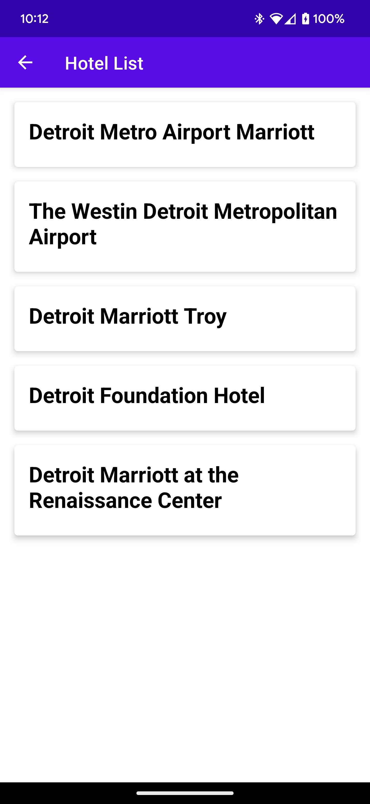

<h1> Hotels_App </h1>

This is a Android app that retrieves hotels list and summary data from a REST API based on searched city (https://hotels4.p.rapidapi.com/) 
using Retrofit and displays it using Jetpack Compose. 

The app consists of three screens: 
1) Search city screen
2) A list of hotels for entered city 
3) Detailed information of a selected hotel.

<h2> Libraries </h2>
The app uses the following libraries:

1) Retrofit and OkHttp3 for REST API calls (GET and POST)
2) Jetpack Compose for UI
3) Navigation with Compose for navigating between screens

<h2> Screenshots </h2>

