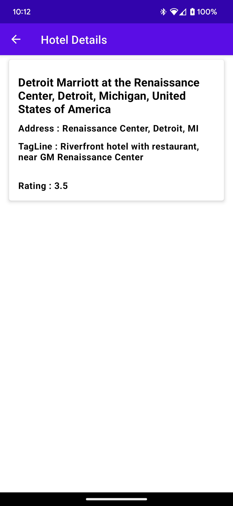

# Hotel_App

This is a Android app that retrieves hotels details data from a REST API (https://hotels4.p.rapidapi.com/) 
using Retrofit and displays it using Jetpack Compose. 

The app consists of three screens: 
1) Search city screen,
2) A list of hotels for entered city 
3) Detailed information of a selected hotel.

Libraries
The app uses the following libraries:
Retrofit and OkHttp3 for REST API calls (GET and POST)
Jetpack Compose for UI
Navigation Compose for navigating between screens

